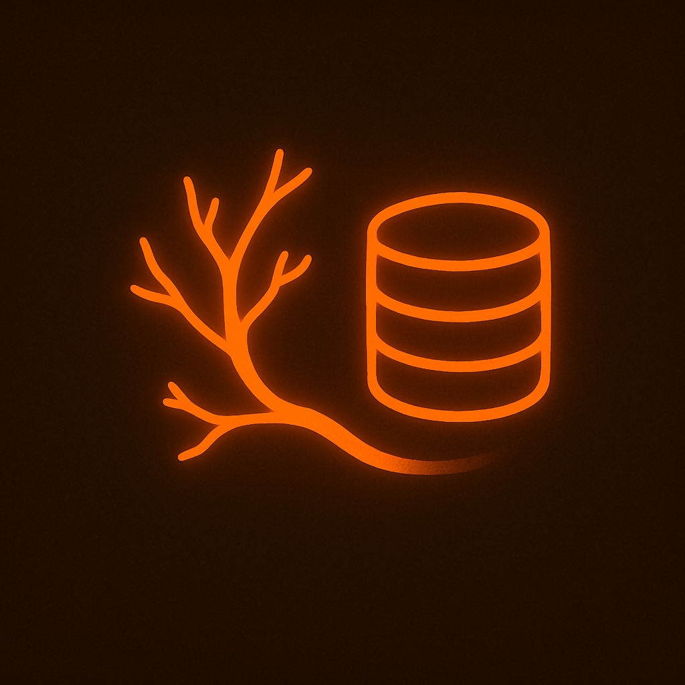

# Branch DB


**Branch DB** is a lightweight, high-performance, and simple key-value database built in C++. It offers in-memory and on-disk persistence for storing and retrieving data efficiently. This project aims to provide a basic yet powerful storage engine to experiment with low-level database concepts.

## Features

- **Key-Value Store:** Efficient storage and retrieval of key-value pairs using std::unordered_map as the core in-memory data structure.
- **Persistence:** Supports on-disk storage with append-only logs for durability
- **Serialization:** Efficient binary format for encoding and decoding data
- **Concurrency:** Reader-Writer locks for thread-safe operations
- **TTL:** Support for setting expiry times on keys, with automatic background cleanup of expired entries.
- **API/CLI Support:** Basic command-line interface for interacting with the database


### ✅ In Scope:
- Basic key-value data storage engine
- On-disk persistence via append-only logs
- In-memory indexing for fast key lookups
- Data serialization/deserialization logic
- Safe concurrent access (read/write locks)
- Simple CLI interface for basic operations
- Unit, integration, and benchmark testing
- Clear documentation and open-source release

## Architecture

Branch DB is designed with a minimalistic architecture to focus on core database principles like storage, concurrency and durability. The system consists of the following components:

1. **Storage Engine** – Manages in-memory and on-disk data storage.
2. **Concurrency Layer** – Implements thread-safety with read-write locks.
3. **Persistence Layer** – Ensures durability by writing data to disk via log files.
4. **TTL Manager** – A background thread that periodically scans for and removes expired keys.

## Run Code
⚠️ Go to Root Directory of BranchDB
```
mkdir build
cd build
cmake ..
cmake --build .
cd Debug
./BranchDB.exe
```
### OR
### If you are on BASH/UNIX terminal, directly run
```
./branchdb-run.sh
```